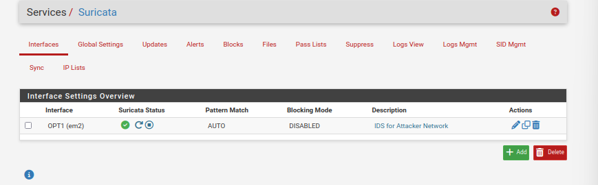
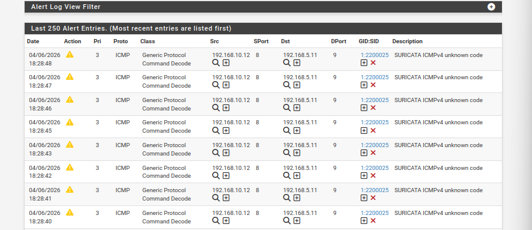
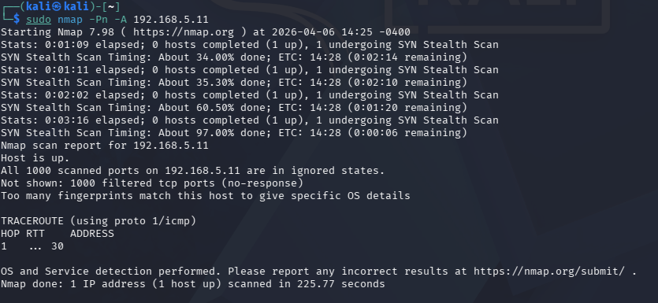

---
## Day 6: Intrusion Detection System (IDS) Implementation

**Objective:** To deploy an active monitoring layer that can identify and log malicious activities and reconnaissance attempts.

###  Key Technical Steps:
* **Package Integration:** Installed and configured **Suricata** as a high-performance Network IDS/IPS.
* **Interface Monitoring:** Configured Suricata to monitor the `OPT1` (Attacker) interface in **Promiscuous Mode**.
* **Signature Ruleset:** Enabled **Emerging Threats Open Rules** to provide up-to-date protection against modern attack signatures.
* **System Optimization:** Resolved VirtualBox driver conflicts by disabling **Hardware Checksum Offloading** in pfSense, ensuring Suricata can analyze every packet.
* **Network Recovery:** Manually reconfigured Kali Linux network stack (`ip route` & `ip addr flush`) to maintain connectivity through the monitored segment.

### Security Testing (Proof of Concept):
* **Attack Vector:** Executed an aggressive OS fingerprinting scan from Kali using `nmap -Pn -A`.
* **Firewall Reaction:** The pfSense firewall correctly **filtered all 1,000 ports**, providing zero information back to the attacker.
* **IDS Reaction:** Suricata successfully triggered multiple **Priority 1 and 3 alerts**, specifically identifying the non-standard ICMP packets used by Nmap for OS detection.

### Evidence of Detection
#### 1. Suricata Service Status
*Suricata is active and monitoring the Attacker-Net.*

#### 2. Intrusion Alerts Log
*Real-time detection of Kali Linux and Nmap fingerprinting attempts.*

#### 3. Attacker's Perspective (Kali)
*The scan was completely blocked by the firewall while being logged by the IDS.*

