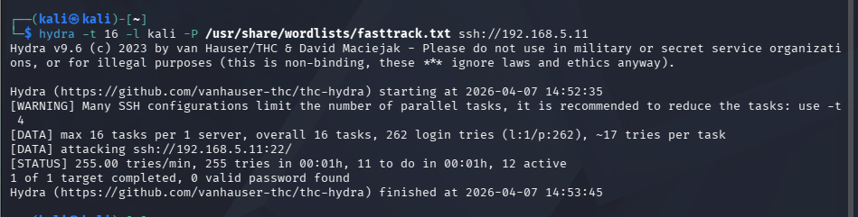
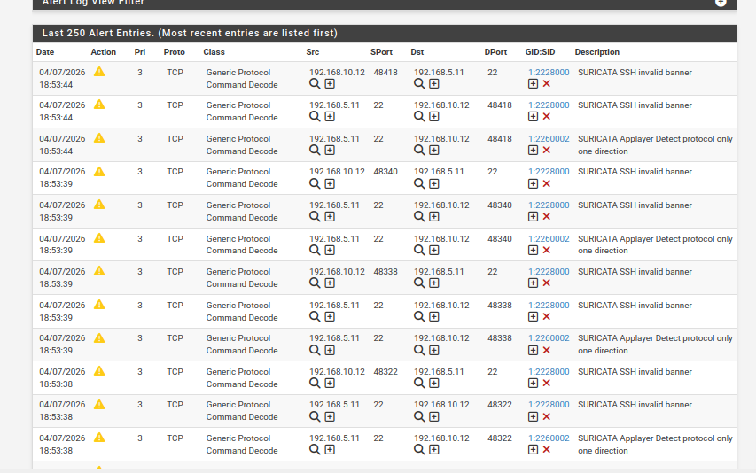

---
## Day 7: Intrusion Prevention System (IPS) & Active Defense

**Objective:** To upgrade the intrusion detection setup into an active Intrusion Prevention System (IPS) capable of automatically blocking malicious actors in real-time.

### Key Technical Steps:
* **Firewall Rule Adjustment:** Configured the pfSense firewall to `Pass` SSH (port 22) traffic from the Attacker network to the Victim machine, allowing Suricata to deeply inspect the application-layer payload.
* **IPS Configuration:** Enabled the **Block Offenders** feature (Legacy Mode) within Suricata to transition from passive logging to active threat mitigation.
* **Rule Tuning:** Verified and activated specific *Emerging Threats* signatures targeting SSH brute-force attempts and protocol anomalies.

### Security Testing (Proof of Concept):
* **Attack Vector:** Simulated an aggressive SSH brute-force attack against the Ubuntu server using **Hydra** (`hydra -t 16 -l kali -P /usr/share/wordlists/fasttrack.txt ssh://192.168.5.11`).
* **Detection:** Suricata successfully identified the protocol violations, triggering multiple alerts including `SURICATA SSH invalid banner` and `Applayer Detect protocol only one direction`.
* **Automated Mitigation:** Upon detecting the malicious behavior, Suricata dynamically added the attacker's IP (`192.168.10.12`) to the pfSense blocklist, successfully cutting off the attack and protecting the server.

### Evidence of IPS Functionality

#### 1. Attacker's Perspective (Hydra SSH Brute Force)
*Simulating a multi-threaded password guessing attack from Kali Linux.*

#### 2. Suricata Alerts (Deep Packet Inspection)
*Real-time detection of protocol manipulation and unauthorized scanning.*

