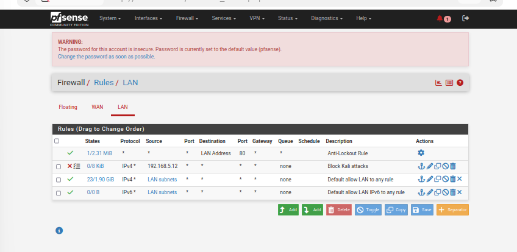
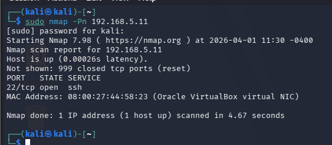
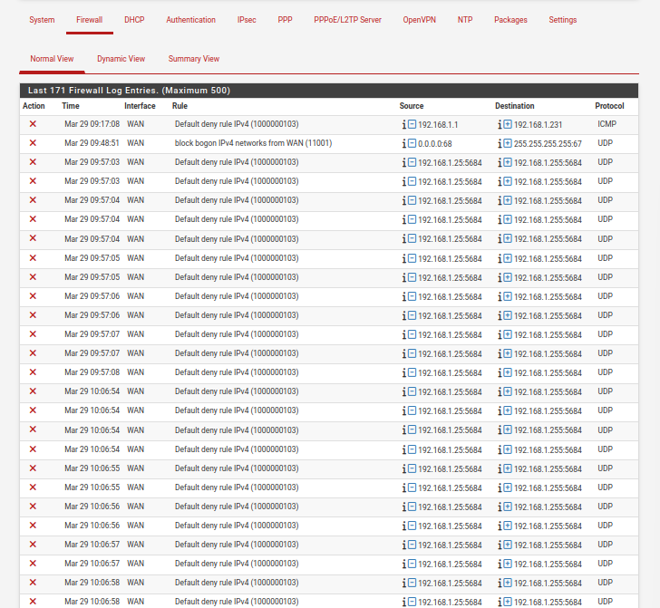

## Day 3: Firewall Rules & The Layer 2 Challenge
**Goal:** Implement access control policies on pfSense and monitor network traffic.

### Technical Accomplishments:
1.  **Policy Creation:** Defined a specific **Block/Reject Rule** on the LAN interface to isolate the Kali Linux attacker (`192.168.5.12`).
2.  **Logging Configuration:** Enabled packet logging for the specific rule to capture and analyze unauthorized access attempts.
3.  **State Table Management:** Utilized `Diagnostics -> Reset States` to force the firewall to re-evaluate active connections after policy changes.
4.  **Network Analysis:** Discovered that traffic between Kali and Ubuntu was bypassing the firewall because both machines reside in the same **Layer 2 broadcast domain** (same Internal Network).

### Key Learning: The "Direct Communication" Issue
During testing, `nmap` continued to show Port 22 as `open` despite the firewall rule. 
* **The Cause:** Since both VMs are on the same subnet, they communicate directly via MAC addresses (ARP), skipping the pfSense gateway entirely. 
* **The Solution for Day 4:** Network segmentation (VLANs or separate subnets) is required to force traffic through the firewall's inspection engine.

---
### **Evidence of Day 3 Lab**

#### **1. Firewall Policy Configuration**

*Configured a Layer 3 block rule to isolate the attacker (Kali) from the target (Ubuntu).*

#### **2. Security Analysis & The Layer 2 Bypass**

*Observation: Nmap still detects Port 22 as OPEN. This proves that traffic is flowing directly between VMs on the same subnet, bypassing the pfSense gateway.*

#### **3. Real-time Monitoring**

*Reviewing system logs to analyze how the firewall handles incoming traffic.*
---

## Current Status
- [x] Secure Network Gateway (pfSense)
- [x] Target Hardening (Ubuntu + SSH)
- [x] **New:** Understanding Firewall bypass in flat networks.
- [ ] **Next Step:** Network Segmentation - Moving the Attacker to a separate subnet to enforce security policies.

